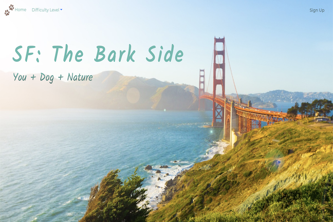

# Project-1-Collab-SF-Trails
**SF: The Bark Side**
**You + Dog + Nature**

**App Name**

We love nature and we love dogs, and we want to provide a useful resource for other dog lovers to enjoy the outdoors in San Francisco. Users will be able to view the trails in detail and share their experiences.

*Link to project hosted on Heroku*

**User Story**

* Upon landing on the homepage, a user will see an image of a hiking trail and be able to sign up or log in. 

* After logging in, the user will be shown a page with a navigation bar at the top, listing 3 difficulty levels (easy, medium, hard). 

* The user can either click on the difficulty level to see the corresponding trail, or scroll down to see the trails.

* Each trail will display an image and some details (i.e., description, distance, difficulty), and an aside section where users can post their experience. 

* After sharing his/her post, the user will be able to edit or delete the post. 

**Technologies Used**

* Frontend: HTML, CSS, JavaScript, Bootstrap
* Backend: Express API, AJAX, jQuery, MongoDB

**Existing Features**

Users can read, create and edit their experiences through posts. 

**Planned Features**

* Incorporate Google Maps API
* Login authorization

**Screenshot(s)**

